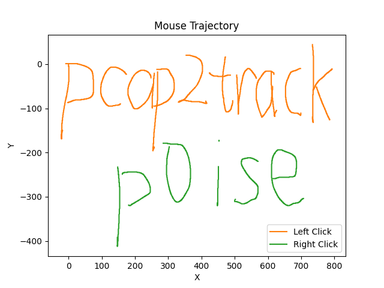

# pcap2track

pcap2track 是 Python 编写的命令行工具，用于解析 pcapng 格式的鼠标流量包并还原出鼠标移动轨迹。



## 安装

1. 下载并解压本项目。
2. 保证 `tshark` 命令可用。
3. 安装 `matplotlib` 库。

## 用法

```shell
pcap2track.py [-h] [-o OUTPUT] pcapng_file [button_mask]
```

**-o:** 用于指定输出图片的名称，默认为 `output.png`。

**button_mask:** 4 位位域，其中每个位对应一个按键状态，默认值为 15（即 0b1111）。当某个位设置为 1 时，表示显示对应按键状态的鼠标轨迹。具体位结构为：

| **Bit** | **Bit Length** | **Description**                         |
| ------- | -------------- | --------------------------------------- |
| 0       | 1              | 当设置为 1 时，表示显示鼠标左键的轨迹。 |
| 1       | 1              | 当设置为 1 时，表示显示鼠标右键的轨迹。 |
| 2       | 1              | 当设置为 1 时，表示显示鼠标中键的轨迹。 |
| 3       | 1              | 当设置为 1 时，表示显示无按键时的轨迹。 |
